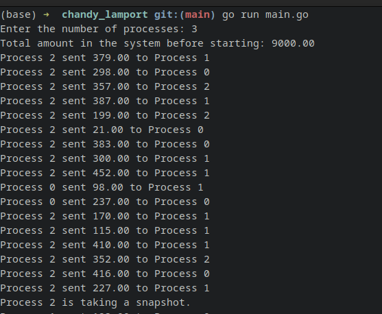
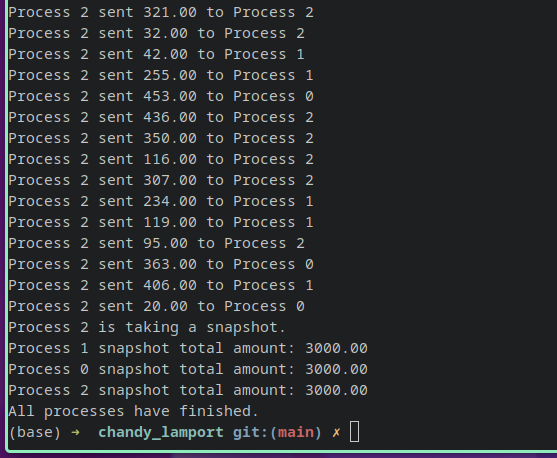

# Chandy-Lamport Snapshot Implementation

This Go program demonstrates an implementation of the Chandy-Lamport algorithm, which is used for taking consistent global snapshots of a distributed system. In this implementation, multiple processes simulate transactions between bank accounts and periodically take snapshots of account balances.

## Overview

The Chandy-Lamport algorithm is used to capture a consistent snapshot of a distributed system's state, ensuring that the snapshot represents a point in time when no process has sent any messages and no channel state has changed. The algorithm enables monitoring the system's global state without disrupting ongoing activities.

## Implementation Details

- The program uses Go's concurrency features to simulate processes running concurrently.
- Each process represents a participant in the distributed system and performs transactions between bank accounts.
- The implementation includes a simplified version of the Chandy-Lamport algorithm by taking snapshots of account balances at specified intervals.
- Random transaction amounts are generated to simulate transactions between processes.
- The program showcases the concept of recording channel states and the algorithm's core idea of consistent snapshot capture.

## Usage

1. Ensure you have Go installed on your system.
2. Clone or download this repository to your local machine.
3. Open a terminal and navigate to the directory containing the downloaded code.
4. Run the following command to build and execute the program:
5. Enter the number of processes when prompted.
6. Observe the program's output, which includes transaction details and snapshot information.

## Example Output

The program provides detailed output for each transaction and snapshot taken during the simulation.

## Notes

- The simulation is a simplified example and doesn't cover real-world security or synchronization considerations.
- The random transaction amounts and recipient processes are generated for demonstration purposes.

